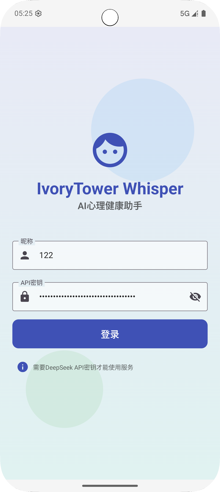
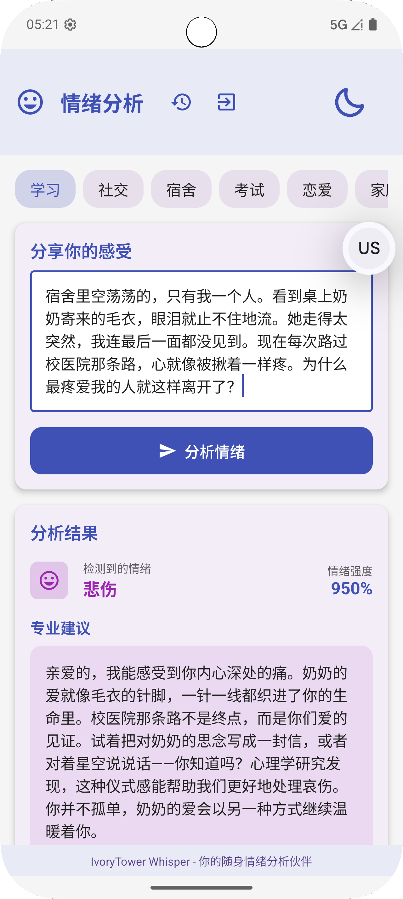
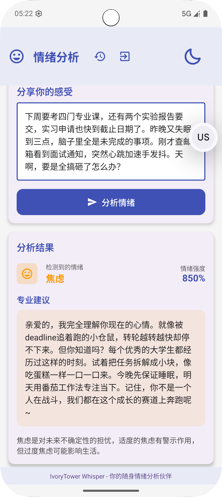
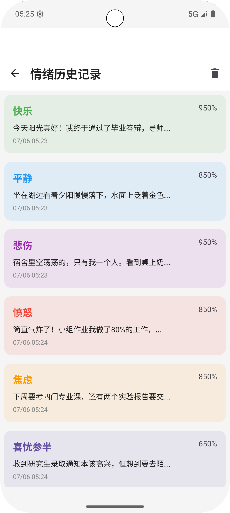
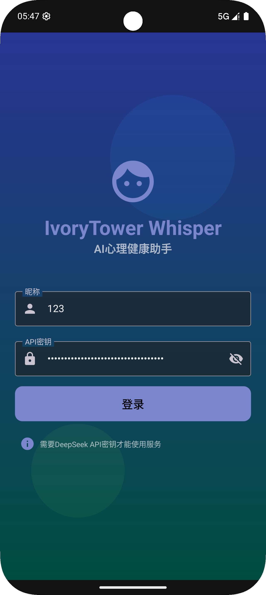
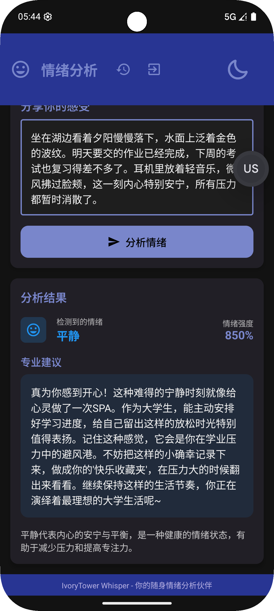
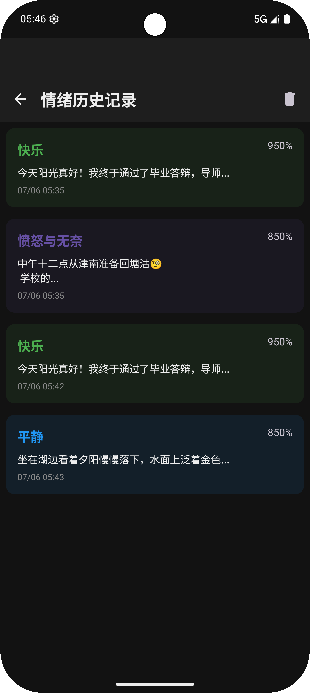

# IvoryTower Whisper (象牙塔心语)


**IvoryTower Whisper (象牙塔心语)** 是一款专为大学生设计的AI心理健康伴侣应用。通过接入DeepSeek的API和精心设计的Prompt，实现了为大学生定制的心理支持功能。用户可以将IvoryTower Whisper当作一位值得倾诉的密友，道出自己的喜怒哀乐，并从应用中获得专业的建议和情感支持。


## 技术栈

- **开发语言**: Kotlin
- **UI框架**: Jetpack Compose
- **架构**: MVVM (Model-View-ViewModel)
- **网络请求**: Retrofit + OkHttp
- **本地存储**: SharedPreferences + Gson
- **API集成**: DeepSeek API
- **动画**: Compose Animation API

## 功能特点

### 🌈 情绪分析与建议
- 智能分析用户输入文本中的情绪状态
- 提供针对大学生的专业心理辅导
- 识别多种情绪类型：快乐、平静、悲伤、愤怒、焦虑等

### 📚 情绪历史记录
- 自动保存每次分析结果
- 时间轴展示情绪变化
- 支持清空历史记录

### 🔐 安全的API密钥管理
- 本地加密存储API密钥
- 自动填充保存的凭证
- 一键退出登录清除凭证

### 🌙 深色/浅色模式
- 自动跟随系统主题
- 支持手动切换主题
- 精心设计的深色模式配色方案

### 🎨 美观的用户界面
- Material Design 3设计规范
- 情感化色彩系统
- 模仿呼吸起伏的动画效果

## 使用说明

### 安装要求
- Android 8.0 (API 26) 或更高版本
- 需要有效的DeepSeek API密钥 
- [获取deepseek API密钥](https://platform.deepseek.com/api_keys) 或 [使用开发者提供的测试密钥](./app/src/main/java/com/chen/ivorytowerwhisper/auth/APIkeys.json)
- [获取APK](https://github.com/chen4546/IvoryTowerWhisper/releases)

### 快速开始
1. 在登录页面输入您的DeepSeek API密钥和昵称       
2. 在分析页面分享您的感受或当前心情
3. 查看应用提供的情绪分析结果和专业建议
4. 在历史页面回顾您的情绪变化历程
   

   


### 主题切换
- 点击右上角的太阳/月亮图标切换深色/浅色模式
- 应用会自动保存您的主题偏好

  

### 演示视频
[模拟器+实机演示](./doc/asset/模拟器+实机演示.mp4)   
前半段为 `Android Studio` 中的模拟器演示，后半段为实机安装 `release` 版的 `APK` 安装包后演示 

## 项目结构

```
├── app
│   ├── src
│   │   ├── main
│   │   │   ├── java/com/chen/ivorytowerwhisper
│   │   │   │   ├── auth
│   │   │   │   │   └── APIkeys.json #存放开发用的APIkey 
│   │   │   │   ├── data
│   │   │   │   │   ├── local        # 本地存储实现
│   │   │   │   │   ├── remote       # 网络请求实现
│   │   │   │   │   └── repository   # 情绪文本仓库       
│   │   │   │   ├── model            # 数据模型
│   │   │   │   ├── ui
│   │   │   │   │   └── theme        # 应用主题和样式
│   │   │   │   ├── viewmodels       # ViewModel实现
│   │   │   │   └── MainActivity.kt  # 应用入口
│   │   │   └── res                  # 资源文件
│   │   └── androidTest              # 测试代码
│   └── build.gradle                 # 模块构建配置
├── build.gradle                     # 项目构建配置
└── settings.gradle                  # 项目设置
```

## 开发指南

### 环境要求
- Android Studio
- Kotlin
- DeepSeek APIKey [测试用APIKey](./app/src/main/java/com/chen/ivorytowerwhisper/auth/APIkeys.json)
- 情绪文本 [测试用emotion text](./app/src/main/java/com/chen/ivorytowerwhisper/data/repository/emotion_text.txt)

### 构建步骤
1. 克隆仓库：
   ```
   git clone https://github.com/chen4546/IvoryTowerWhisper.git
   ```
2. 在Android Studio中打开项目

3. 构建并运行应用

## 联系我们
如有任何问题或建议，请联系我们：305553470@qq.com

---

**让象牙塔里的每一句心语都被温柔聆听**  
**—— IvoryTower Whisper**